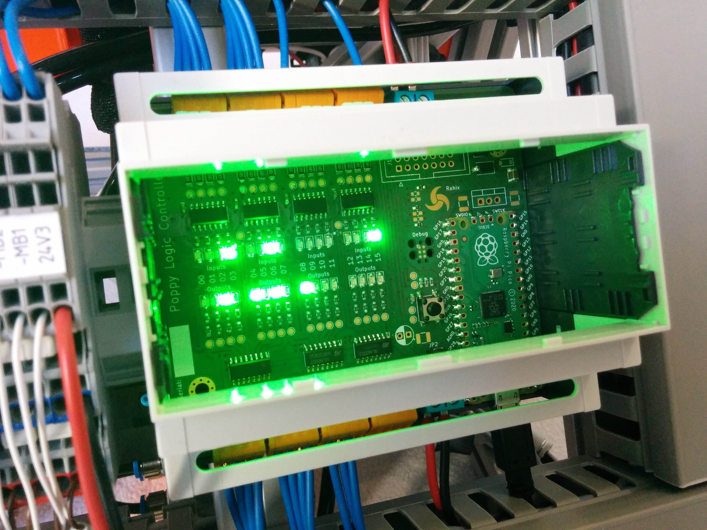

<h2 align="center">Poppy Logic Controller</h2>

---

The _Poppy Logic Controller_ is a budget PLC (Programmable Logic Controller).
Importantly, it is only an I/O board without any PLC programming environment
(so far).  It isn't designed to be super robust but instead to use minimal
components while still staying compatible with standard industrial 24V DC
control systems.

I release the _Poppy Logic Controller_ as open hardware in hopes that others
who need a cheap solution for controlling industrial 24V DC equipment find it
useful.  _This is not a commercially viable PLC alternative._

If you want to know more about the background of this project and details of
the design, you might be interested in the blog post I wrote about it: [**Poppy
Logic Controller**][poppy-blog]

### Features
- Designed for 24V DC systems as most commonly found in modern controls
  applications.
- 16 DI (digital inputs) in a **Sinking Input** configuration.
- 16 DO (digital outputs) in a **Sinking Output** configuration.
- Firmware stubs in [Rust][fw-rust], [MicroPython][fw-mp], and [IEC 61131-3
  _Structured Text_][fw-iec].

<small>Learn more about sinking/sourcing I/O [here][realpars-input] and
[here][realpars-output] or from [my blog-post about this
project][poppy-blog].</small>

### Non-Features
- I/Os are **not** galvanically isolated.  Honestly, the isolators would
  probably be more expensive than the MCU so there is not much incentive to
  implement isolation anyway.
- The board currently does not have any communication interfaces apart from the
  Pico's USB port.  If you need to interface with anything, you might need to
  either update the board design or connect an additional mod onto the `J12`
  header.

### Building Your Own
Rendered versions of the schematic and BOM can be found here:

- [Rendered Schematic](./Docs/PoppyIO.pdf)
- [Rendered BOM](https://rahix.github.io/Poppy-Logic-Controller/Docs/PoppyIO_bom_D.html)
- [Rendered Interactive BOM](https://rahix.github.io/Poppy-Logic-Controller/Docs/PoppyIO_ibom_D.html)

#### Parts
Supplier for almost all parts of this project was [Reichelt Elektronik] (no
affiliation or sponsorship here, purely personal choice).  I've tried
reconstructing the BOM with all the Reichelt SKUs so you can painlessly get all
you need from one place if you so desire.  There is a column in the BOMs linked
above with all the information you need.

#### Additional Components
Beyond the PCB's BOM, you will need a few more components.  After all, you
probably want the nice feeling of mounting your controller on a DIN-rail, don't
you?

1. The enclosure, which is an `APRA-NORM 449-360-65` (Reichelt `APRA DB6 OBK`)
2. Optionally, a lid for the enclosure, like `APRA-NORM 449-360-12` (Reichelt
   `APRA 449-360-12`). Also available in other colors.
3. A few (2) jumpers (Reichelt `JUMPER 2,54 SW`)

#### Hardware Revisions
In the design files, you'll find the latest revision **D**.  I suggest using
that one although it is not exactly the version I have built.  My (2) boards
are built from revision **B** with one populated like revision **C** and one
populated like revision **D**.  You can read the [changelog][poppy-changelog]
for details of the differences.

#### Programming It
This repository contains a bare-bones firmware in Rust and MicroPython to get
started.  Or, if you have a background in automation, you can program the Poppy
Logic Controller in _ST_ (_Structured Text_) using the IEC 61131-3 firmware.
Check the READMEs for more info on that:

- [Firmware-Rust][fw-rust]
- [Firmware-MicroPython][fw-mp]
- [Firmware-IEC][fw-iec]

#### Not using the Pico
If you need a different microcontroller, you can drop the Raspberry Pi Pico and
instead solder the `J12` header.  You can then connect whatever controller you
desire and use the I²C bus (and interrupt lines) to interact with the I/O.

---

If you want to build your own but you are unsure or you have questions about
anything, feel free to contact me to get it sorted out!

## License
- The hardware design files (everything in `Hardware/`) are licensed under the
  [CERN-OHL-W](LICENSE-HARDWARE).
- The firmware stubs (everything in `Firmware-*/`) are licensed under
  [MIT](LICENSE-SOFTWARE).

[Reichelt Elektronik]: https://www.reichelt.de/
[poppy-blog]: https://blog.rahix.de/poppy-logic-controller/
[poppy-changelog]: ./Hardware/PoppyIO/CHANGELOG.md
[realpars-input]: https://realpars.com/sinking-and-sourcing/
[realpars-output]: https://realpars.com/sinking-output/
[fw-rust]: ./Firmware-Rust/
[fw-mp]: ./Firmware-MicroPython/
[fw-iec]: ./Firmware-IEC/
